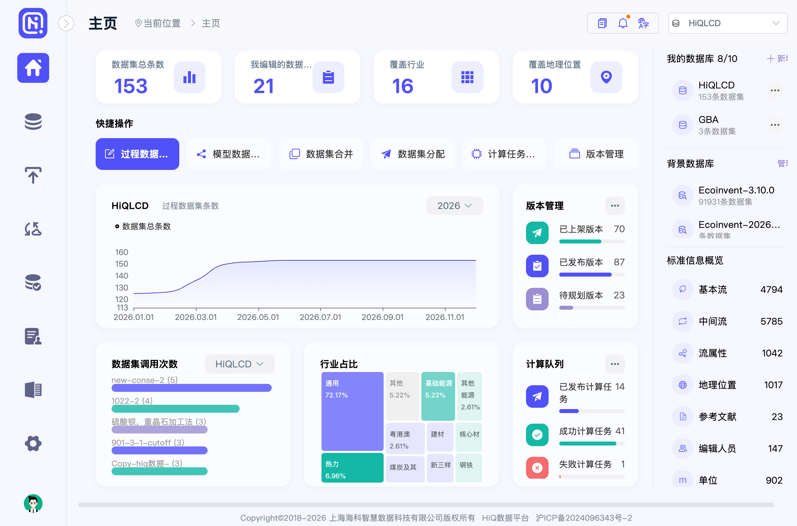
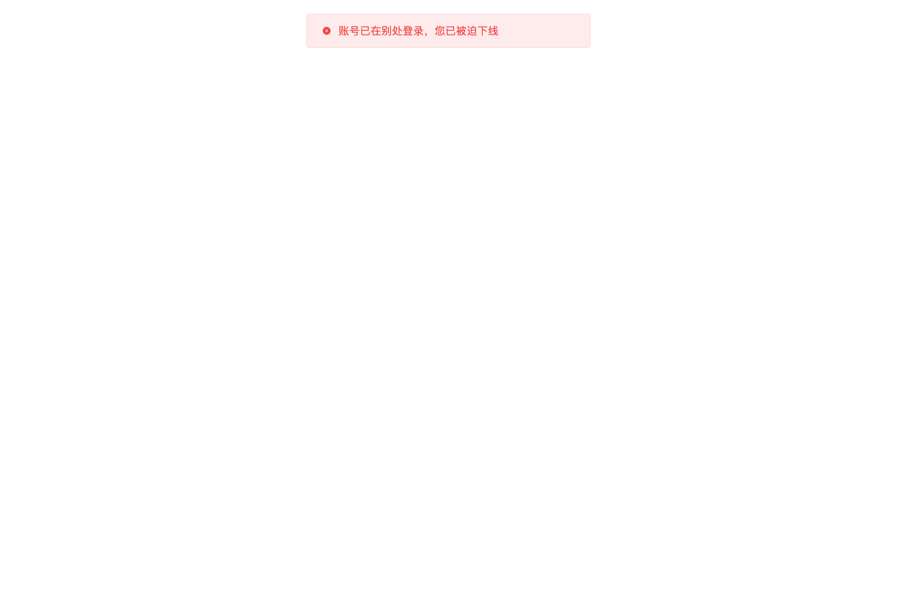
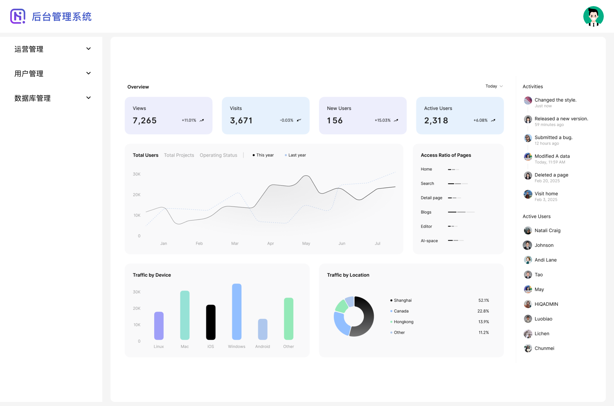
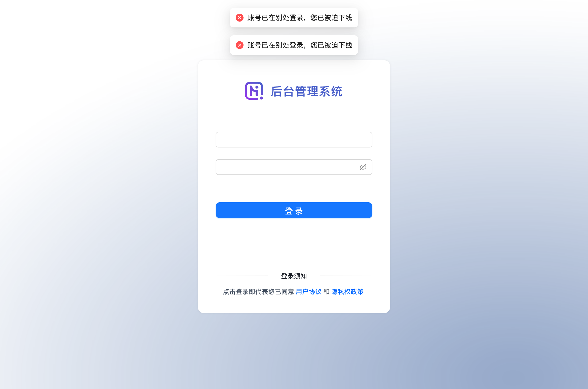
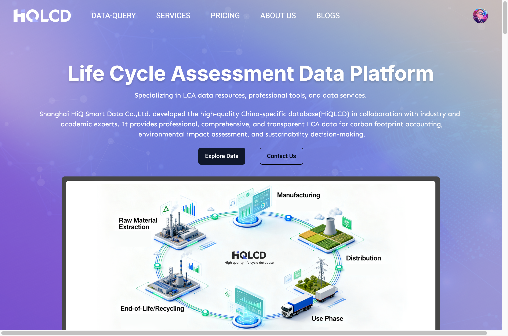
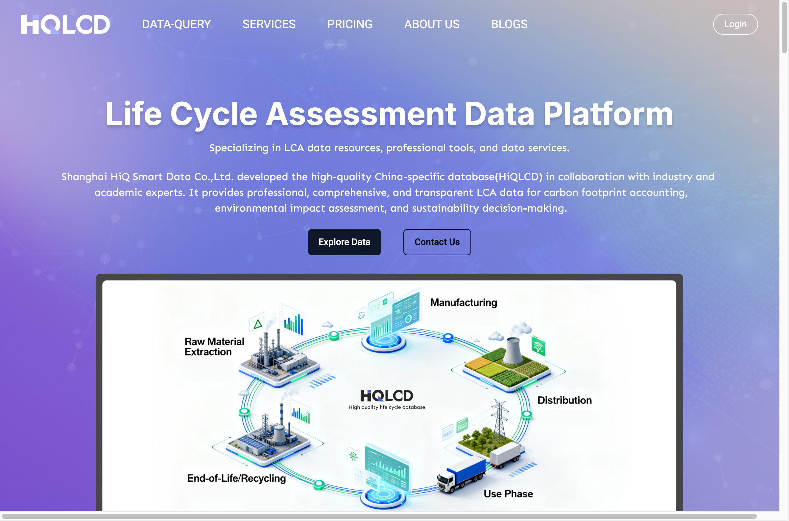

# 顶下线（单设备互踢）强退 — uat E2E 验收报告

- **时间**：2026-06-25
- **环境**：uat2（`editor2` / `backend2` / `www2` .hiqdat.dev）
- **账号**：hiqadmin（共用，错峰执行）
- **被测改动**：dataset-web **#71**（前端识别 4011/4012 强退）+ dataset **#96**（后端 token 失效/被顶返 4011/4012 替代 500）—— feedback#24 配套
- **方法**：Playwright；登录态由 `scripts/uat_login.py`（脚本读环境凭证，全程不代输密码）建立；同账号双登录触发服务端单设备顶下线，再触发受保护请求看前端行为。**每个 case 均附浏览器截图为证。**

## 结论

| 前端 | 入口 | case1 已登录 | case2 顶下线后 | network | 判定 |
|---|---|---|---|---|---|
| **编辑器** | editor2 | ✅ 进主页 | ✅ 强退：toast「账号已在别处登录，您已被迫下线」+ 跳 `/login?redirect=/home` | `code=4011` | ✅ PASS |
| **大后台** | backend2 | ✅ 进后台 | ✅ 强退：双 toast「账号已在别处登录，您已被迫下线」+ 跳 `/login` | `code=4011` | ✅ PASS |
| **广场** | www2 | ✅ 头像=已登录 | ✅ 静默登出：头像→「Login」，**无 toast、无报错** | `code=4011` | ✅ PASS（行为差异见 §4） |

> 重要：#71 单独验收时（#96 合并前）曾为「假性修复 FAIL」——后端那时仍返 500「系统错误」，前端拿不到 4011 无从识别强退。**#96（06-25 合并并部署 uat2）让后端真正返 4011 后，#71 才真正生效**，本次三端复测确认闭环。

---

## 1. 编辑器 editor2（#71 直接验收对象）

**验收点**：被顶下线后，前端识别 `code=4011` → 弹「账号已在别处登录，您已被迫下线」+ 跳登录页（替代李辰反馈的「不强退、在报错」）。

| case | 实测 | 截图 |
|---|---|---|
| 1 已登录 | `editor2/home` 主页正常加载（数据信息条数/版本管理/计算队列…） |  |
| 2 顶下线 | 第二处登录顶掉本会话 → reload → toast「账号已在别处登录，您已被迫下线」+ 跳 `/login?redirect=%2Fhome` |  |

实测 `GET /api/sso/user/info/current?productCode=hiq_editor` 返 `{"code":4011,"msg":"账号已在别处登录，您已被迫下线"}`。

## 2. 大后台 backend2（同款强退，佐证 #96 后端透传）

大后台是独立前端（Ant Design），与编辑器（element-plus）不同，但同样消费 dataset-sso 的 4011。

| case | 实测 | 截图 |
|---|---|---|
| 1 已登录 | `backend2` 后台管理系统首页（运营/用户/数据库管理） |  |
| 2 顶下线 | reload → 两条 toast「账号已在别处登录，您已被迫下线」+ 跳 `/login` |  |

实测 `GET /api/sso/user/info/current?productCode=hiq_backend` 返 `code=4011`。

## 3. 广场 www2（行为不同：静默登出）

| case | 实测 | 截图 |
|---|---|---|
| 1 已登录 | 右上角头像（`/xapi/user/session` 返 `isLoggedIn:true, hiqadmin`） |  |
| 2 顶下线 | reload → 右上角变回「Login」按钮，**无 toast、无报错** |  |

## 4. 广场为何不同（机制）

广场是 Next.js，登录态走服务端 **iron-session**（加密 cookie `app-session-cookie`），无 middleware。前端 SWR 轮询 `GET /xapi/user/session`，该路由**每次都拿 accessToken 回 `/api/sso/user/info/current?productCode=hiq_square` 重校验**；拿到 4011（≠200）→ `catch` → `clearAuthCookies()` + `isLoggedIn:false` → UI 翻回未登录。

- ✅ 广场会**正确登出、不卡死/不报错**——没有李辰反馈的 editor bug。
- ⚠️ 少一句「您已被迫下线」提示（静默），用户可能困惑「怎么突然没登录了」。是否补提示由产品定，**非 bug**。

## 5. 顺带发现的安全问题（已另开 task，未自动改）

广场把 **iron-session 加密密钥明文硬编码**进 `square-web-next/app/session/lib.ts` 并提交进 git → 任何看过代码者可伪造任意用户会话（本次验收即用此法 seal 出 hiqadmin 会话登入广场，无需密码）。建议改环境变量注入 + 轮换已泄露密钥。

## 附：复现/登录态注入

- 编辑器/大后台（dataset-web SPA，自管 token）：注入 cookie `user`(含accessToken)+`accessToken`。
- 广场（Next.js iron-session）：cookie 注入登不进，需用 `iron-session` 的 `sealData()`+lib.ts 密钥造 `app-session-cookie`，连同 `satoken`/`userId`/`accessToken` 一起注入。
- 顶下线：同账号同 device（productCode）二次登录即触发服务端单设备互踢（dataset-sso `is-concurrent=false` + LoginDeviceResolver 按 backend/editor/square 区分 device，跨站点不互踢、同站点互顶）。
